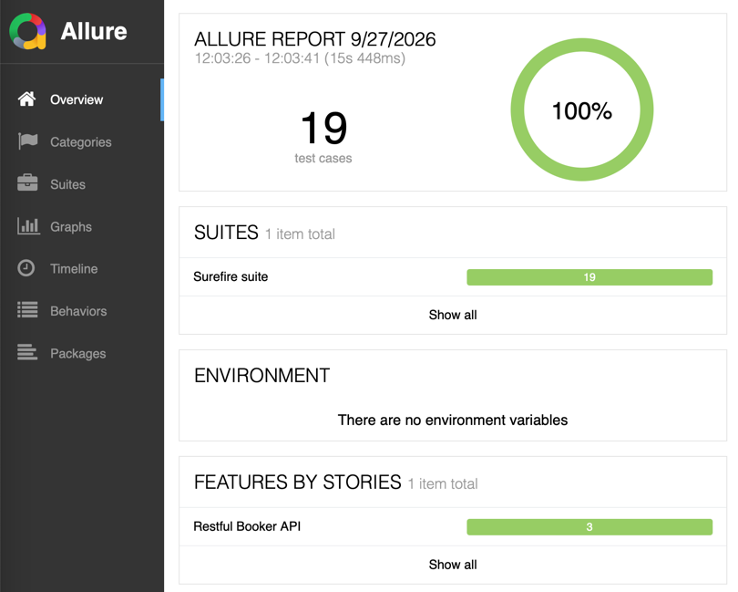
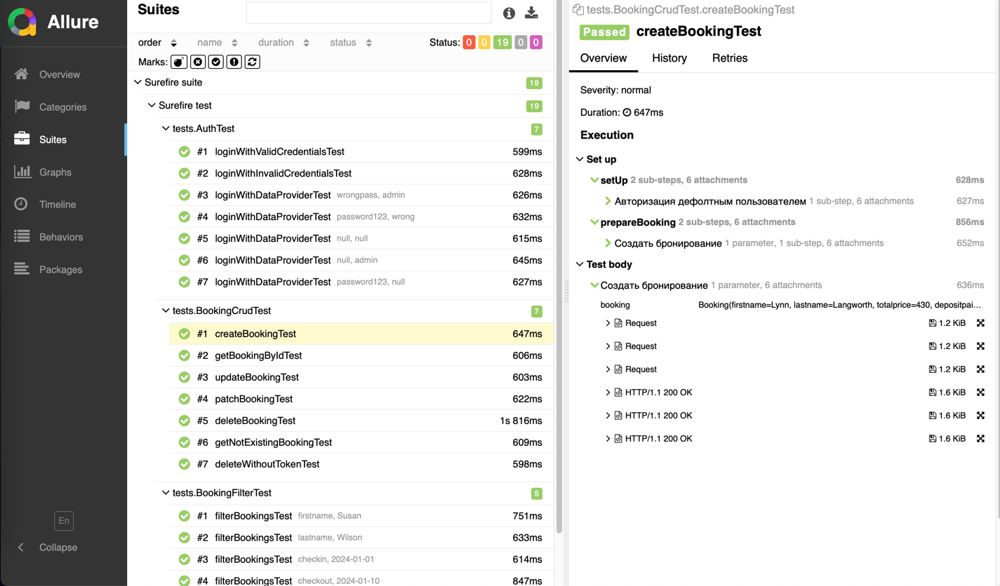

# API Automation Project (Rest Assured + TestNG)

[](https://github.com/AndreiDovidovich/rest-assured-testng-project/actions/workflows/ci.yml)


API-автотесты для [restful-booker.herokuapp.com](https://restful-booker.herokuapp.com) на RestAssured + TestNG + Allure.
Проект демонстрирует **API client layer**, **POJO-модели**, **DataProvider**, **Allure-отчётность** и **GitHub Actions CI**.

## Стек

| Технология | Версия | Назначение |
|------------|--------|------------|
| Java | 21 | Язык |
| RestAssured | 6.0.1 | HTTP-клиент для API-тестов |
| TestNG | 7.12.0 | Test runner + DataProvider |
| Jackson | 2.22.1 | Сериализация POJO ↔ JSON |
| AssertJ | 3.27.7 | Читаемые assertions |
| Datafaker | 2.7.0 | Генерация тестовых данных |
| Lombok | 1.18.46 | Убирает boilerplate (`@Data`, `@Builder`) |
| Allure Report | 2.35.5 | Отчётность |
| AspectJ | 1.9.22.1 | Для `@Step` из Allure |
| Maven | 3.9+ | Сборка |
| Log4j2 | 2.26.1 | Логирование |

## Что тестируется

**REST API [restful-booker](https://restful-booker.herokuapp.com/apidoc/index.html)** — публичный сервис для тренировки API-автотестов.

| Feature | Endpoints | Покрытие |
|---------|-----------|----------|
| **Auth** | `POST /auth` | валидные креды, невалидные креды, data-driven |
| **Booking CRUD** | `POST /booking`<br>`GET /booking/{id}`<br>`PUT /booking/{id}`<br>`PATCH /booking/{id}`<br>`DELETE /booking/{id}` | create, read, update, partial update, delete, 404 |
| **Booking Filters** | `GET /booking?firstname=&lastname=&checkin=&checkout=` | фильтрация, список всех броней |
| **Security** | `DELETE` без токена | 401/403 |

## Архитектура

```
src/main/java/
├── clients/           # HTTP-клиенты для API-эндпоинтов
│   ├── BaseClient.java
│   ├── AuthClient.java
│   └── BookingClient.java
├── models/            # POJO для request/response
│   ├── auth/
│   │   ├── AuthRequest.java
│   │   └── AuthResponse.java
│   └── booking/
│       ├── Booking.java
│       ├── BookingDates.java
│       └── BookingResponse.java
├── specs/             # RequestSpecification / ResponseSpecification
│   └── RequestSpecs.java
└── utils/
    ├── LoadPropertiesUtils.java
    ├── HttpStatus.java  # enum HTTP-статусов (OK, CREATED, NOT_FOUND, ...)
    └── TestDataFactory.java

src/test/java/
├── tests/             # Тесты
│   ├── BaseTest.java
│   ├── AuthTest.java
│   ├── BookingCrudTest.java
│   └── BookingFilterTest.java
└── resources/
    ├── config.properties
    ├── allure.properties
    └── log4j2.xml
```

**Три слоя абстракции:**

- **`clients/`** — HTTP-клиенты. Знают про endpoints, коды ответов, парсинг.
- **`models/`** — POJO. Типобезопасные request/response.
- **`specs/`** — общая конфигурация RestAssured (base URL, headers, filters, логирование).
- **`tests/`** — только сценарии и проверки. **Никакого RestAssured в тестах.**

## Как запустить

```bash
# Все тесты
mvn clean test

mvn clean test -DsuiteXmlFile=testng.xml

# Только smoke suite
mvn clean test -DsuiteXmlFile=testng-smoke.xml
```

## Allure-отчёт

```bash
mvn allure:serve
```

Откроется браузер с интерактивным отчётом:
- **шаги** каждого HTTP-запроса (метод, URL, headers, body),
- **полные request/response** через `AllureRestAssured`,
- **группировка** по Epic/Feature/Story,
- **история прогонов**.

### Пример отчёта





## CI

GitHub Actions запускает тесты:
- **на PR** — только smoke suite (быстро),
- **на push в main** — полный suite,
- **ночью** — полный suite,
- **вручную** — выбор suite через dropdown.

Результаты публикуются на GitHub Pages.

Workflow: [`.github/workflows/ci.yml`](.github/workflows/ci.yml)

## Структура проекта

```
.
├── .github/
│   └── workflows/
│       └── ci.yml                    # GitHub Actions
├── src/
│   ├── main/java/
│   │   ├── clients/                  # HTTP-клиенты
│   │   ├── models/                   # POJO
│   │   ├── specs/                    # RequestSpecs / ResponseSpecs
│   │   └── utils/                    # LoadPropertiesUtils, TestDataFactory, HttpStatus
│   └── test/
│       ├── java/tests/               # Тесты
│       └── resources/
│           ├── config.properties     # base.url, креды
│           ├── allure.properties     # Allure links
│           └── log4j2.xml            # Логирование
├── testng.xml                        # Full suite
├── testng-smoke.xml                  # Smoke suite
├── pom.xml
└── README.md
```

## Пример теста

```java
@Test(dataProvider = "invalidCredentials")
public void loginWithDataProviderTest(String username, String password) {
    var response = authClient.postAuth(username, password);

    assertThat(response.statusCode()).isEqualTo(OK.code());
    assertThat(response.jsonPath().getString("reason"))
            .isEqualTo("Bad credentials");
}

@DataProvider(name = "invalidCredentials", parallel = true)
public Object[][] invalidCredentials() {
    return new Object[][] {
            { "admin", "wrongpass" },
            { "wrong", "password123" },
            { "",      "" }
    };
}
```